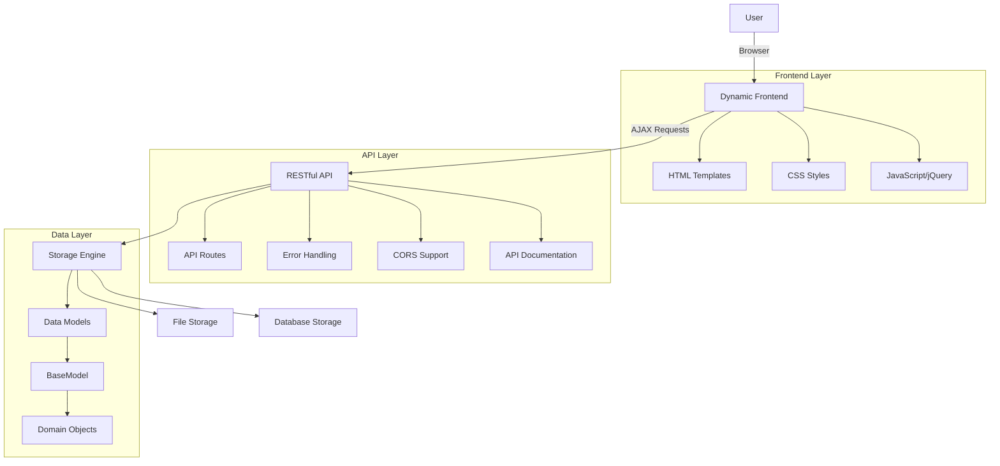
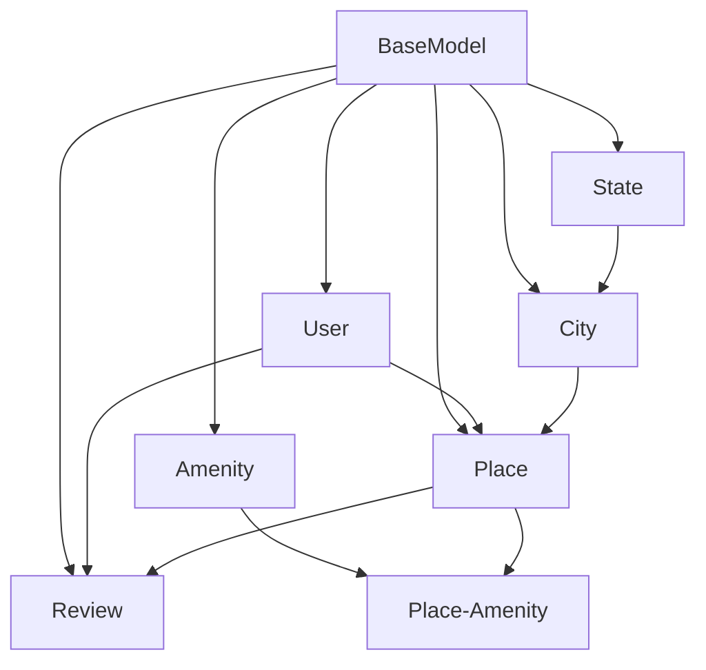
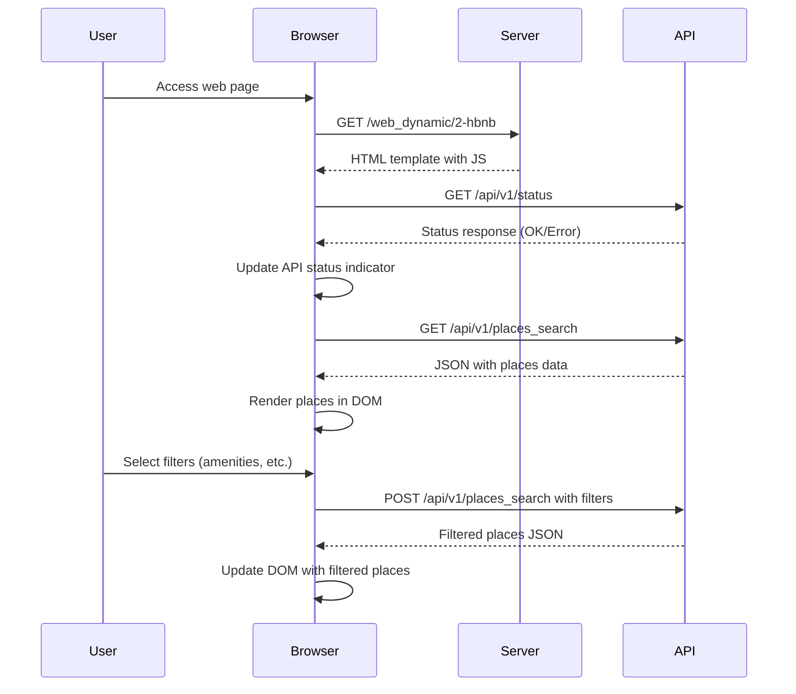
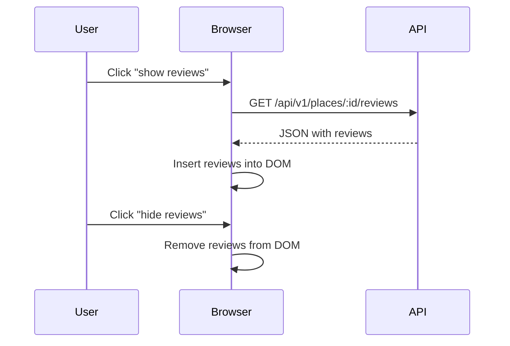
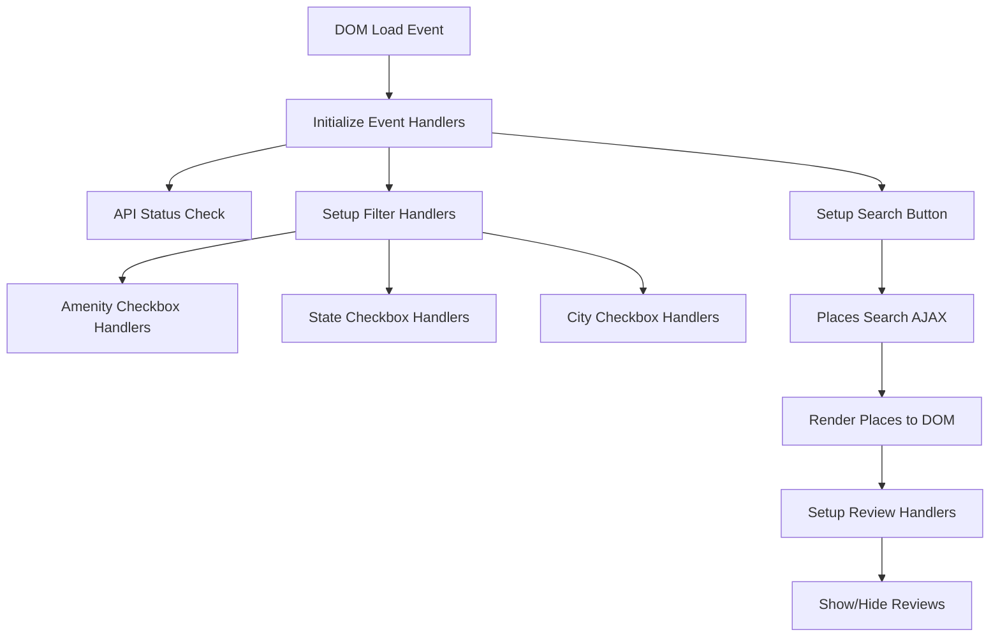

# AirBnB Clone v4 - Architecture Overview

This document describes the architectural design of the AirBnB Clone v4 project, highlighting the dynamic front-end enhancements.

## System Architecture

The AirBnB Clone v4 follows a client-server architecture with a clear separation between the front-end and back-end:

## Data Models

Our application's data model follows this structure:

## Component Details

### Frontend (`web_dynamic/`)

- **HTML Templates**: Base templates with placeholders for dynamic content
- **CSS Styles**: Visual styling with responsive design
- **JavaScript**: 
  - API interaction using AJAX
  - DOM manipulation for dynamic content updates
  - Event handling for user interactions
  - Filtering functionality

### API (`api/v1/`)

- **Enhanced App**: Error handling, CORS support, and Swagger integration
- **Resource Endpoints**: RESTful routes for all domain objects
- **Search Functionality**: Advanced filtering and search capabilities

### Data Layer

- **Optimized Storage**: Enhanced file and database storage with improved methods
- **Data Models**: Domain objects with serialization/deserialization support

## Data Flow

### Dynamic Page Loading

### Review Loading

## Frontend Architecture

The JavaScript code is organized with the following structure:

## Key Improvements in v4

- **AJAX Integration**: Asynchronous data loading without page refreshes
- **Enhanced Error Handling**: Proper HTTP status codes and error messages
- **API Documentation**: Swagger integration for interactive API documentation
- **Filter State Management**: Client-side state tracking for filters
- **Responsive UI Updates**: DOM manipulation for dynamic content changes
- **Cross-Origin Support**: CORS configuration for API access

## Technical Architecture Decisions

1. **Separation of Concerns**:
   - Backend API completely separate from frontend
   - Frontend consumes API just like any third-party would

2. **Progressive Enhancement**:
   - Application still functional even if JavaScript is disabled (falls back to v3)
   - Core functionality preserved across all versions

3. **API-First Design**:
   - RESTful principles applied consistently
   - JSON as the primary data exchange format
   - Stateless communication between client and server

4. **Client-Side Filtering**:
   - Filter state maintained in client memory
   - Targeted API requests to minimize data transfer
   - Only reloading the necessary components
